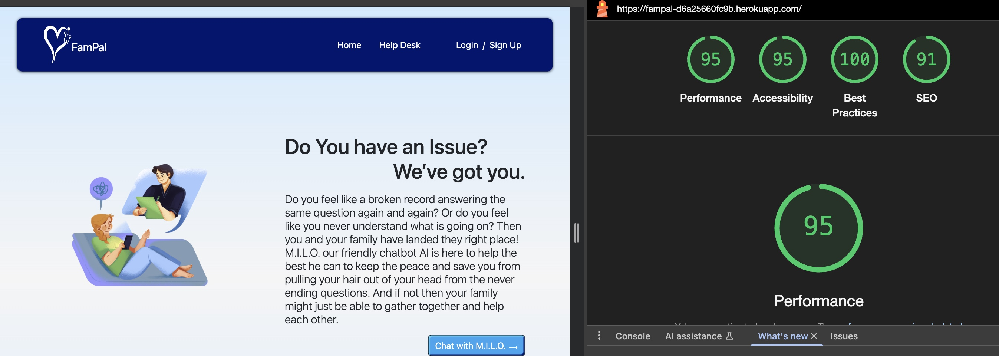
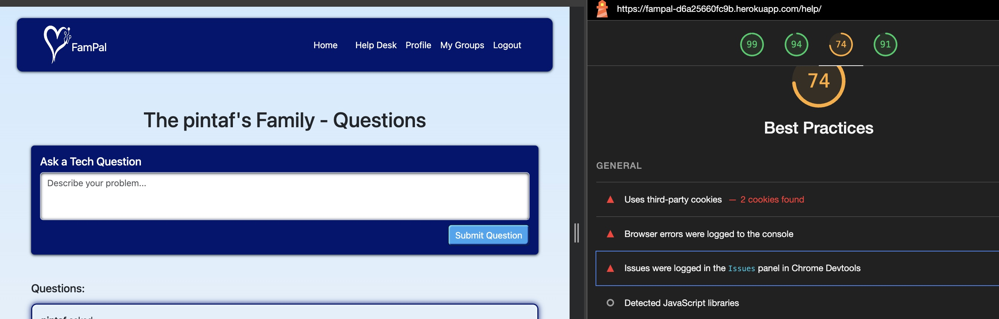
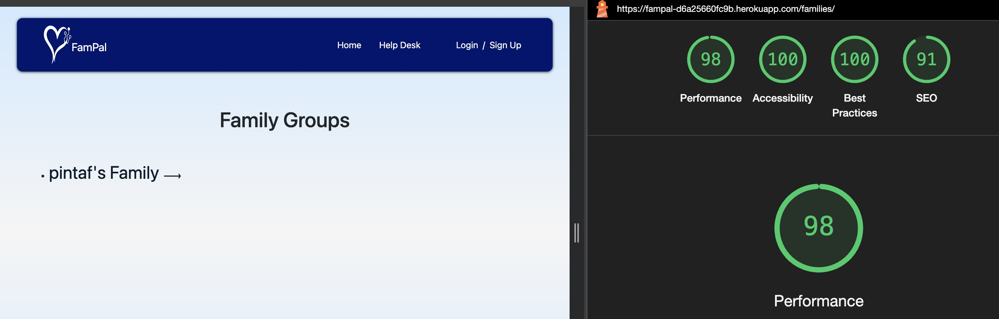
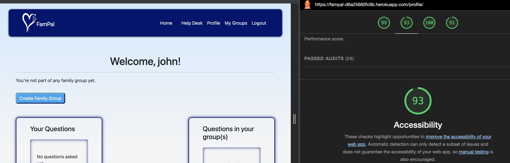
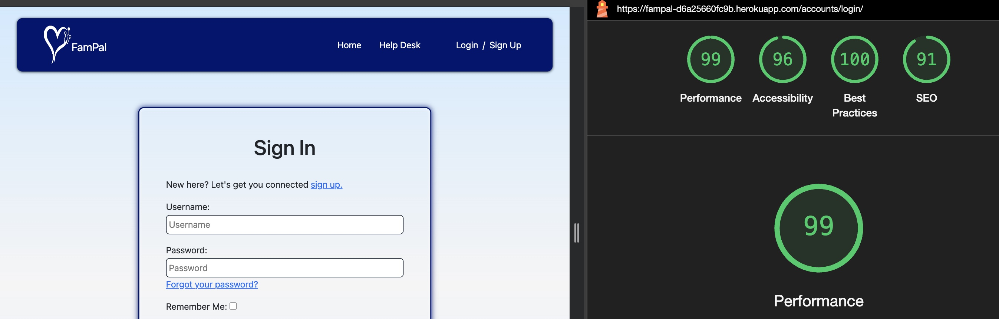
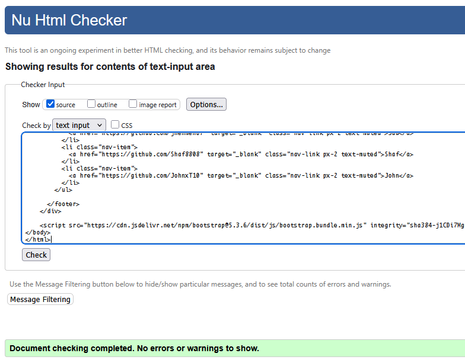
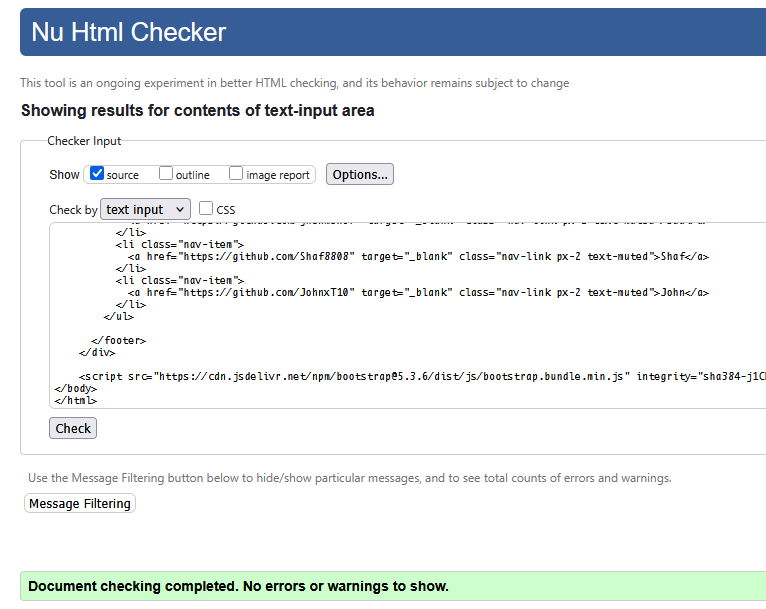
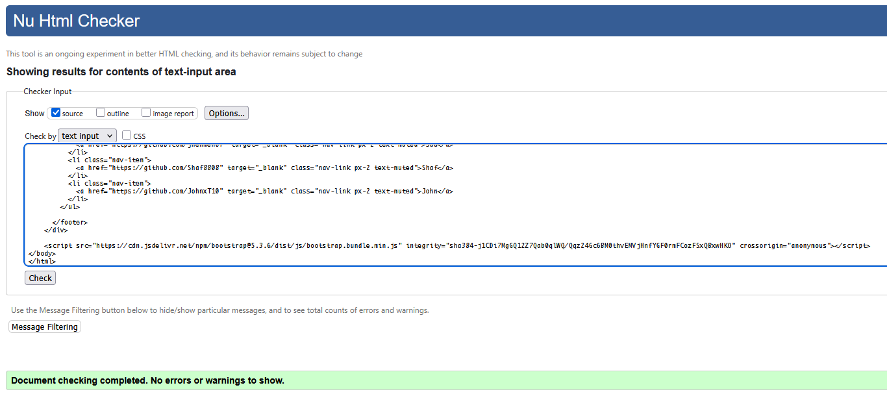
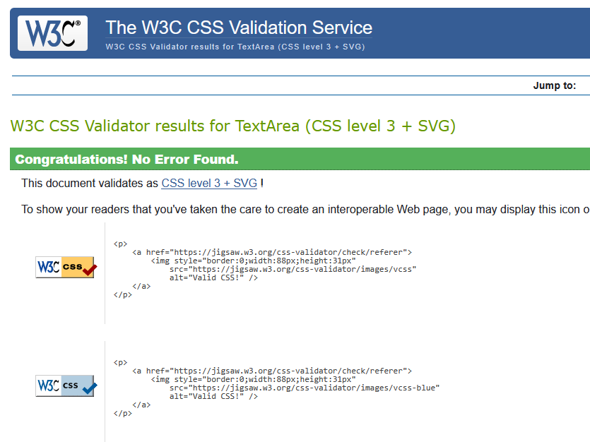

# Tests

## Lighthouse

Lighthouse is an open-source tool for improving the quality of web pages. It provides insights into performance, accessibility, best practices, and SEO. Below are the results from Lighthouse tests for various pages and devices.

### Home Page

Optimizations

    

### Help Desk

Optimizations

    

### Family Groups Page

Optimizations

    

### Profile Page

Optimizations

    

### Sign In / Sign Out Page

Optimizations

    

## Code Validation

### HTML Validation

The HTML validation process was conducted using the [Nu HTML Checker](https://validator.w3.org/). Below are the results for various pages on the website, highlighting any errors and warnings found which none were found. 

Home Page Validation

    

Home Page Validation

    

Help Desk Page

    

## CSS

The CSS validation was conducted using the [W3C CSS Validation Service](https://jigsaw.w3.org/css-validator/) with no errors found.

Main CSS Validation

    

